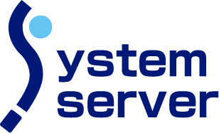
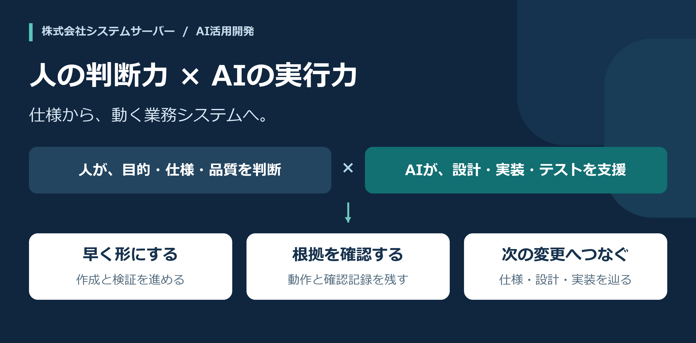
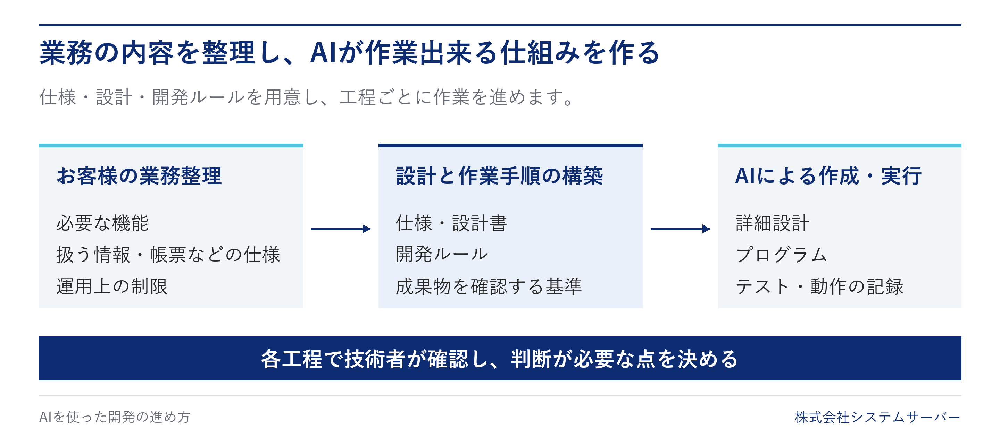
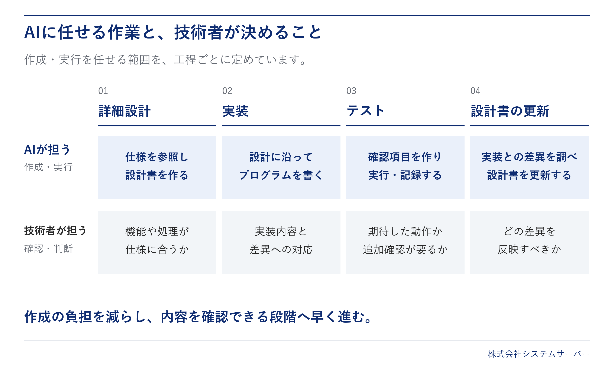
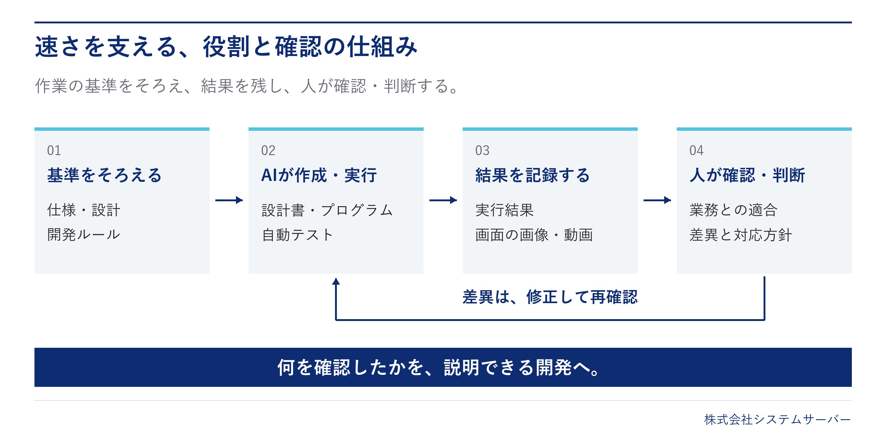
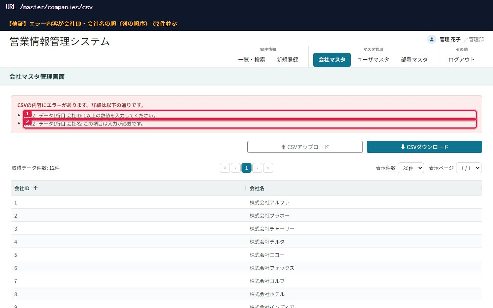

# 業務を知る技術者が、AIを使って開発する。

株式会社システムサーバー｜AIを活用した業務システム開発の実践検証事例紹介

生産管理、物流管理、自動車や電力に関わるシステム。当社は、[お客様の業務に長く関わり、提案から開発、運用・保守まで](https://www.system-server.com/business/)を手がけてきました。
日々の仕事を理解し、仕様を詰め、システムを具体化していく。その開発に、システムサーバーはAIの力を活用していきます。

人が業務の目的と品質を見極め、AIが成果物の作成と検証を支える。
この組み合わせで、開発のスピードを高め、業務改善を具体化するまでの時間を短くすることを目指します。

## 業務の理解と開発の経験を、AIが作業するための土台に

業務システムの開発にはお客様の業務固有の知識が必要です。
お客様にあわせた仕様を整理し、設計に人が落とし込みます。AIには、それらを参照させて作業を進めさせます。

## 設計書の作成、実装、テストを効率化する

設計書を読み、プログラムを書き、画面を操作して動作を確認する。変更が入れば、設計書も更新する。
開発で繰り返し発生するこれらの作業をAIに担わせます。
これにより作成にかかる時間を減らし、具体的な画面や動作を確認できる段階へ早く進むことが狙いです。

また、重要なのはAIの生成した成果物を技術者の目で確認することです。AIの成果物の良し悪しの見極めは現場業務を熟知した技術者自身でおこないます。

確認により仕様と違う点があれば修正し、同じテストで再確認する。この繰り返しを基本とし、開発のすべての工程で行います。

## 開発した営業情報管理システム

当社の社内システム開発で、設計書の作成からプログラムの実装、テストまで、AIを使った開発を実践検証しました。
このリポジトリでは、そこで作成したアプリケーションと設計資料、テストの記録を公開しています。

案件の検索・登録・更新を中心に、添付ファイル、メール送信、会社・部署・ユーザの管理、CSV入出力を備えたWebアプリケーションです。
ログインや権限による制御、入力内容のチェックなど、業務システムに必要な処理も含めています。

AIを使ってテストを作成・実行し、画面の画像や動画、実行結果を残しています。

実際のテストで取得した画面。上部の説明と色付きの枠は、確認した箇所を示すために付けたものです。

## お客様の開発にも、この取り組みを

業務システムの新規開発や改修で、AIをどの工程に使えるか。必要な資料は何か。どこを人が判断し、どう動作を確かめるか。
対象となる業務と現在のシステムを伺い、具体的な進め方、導入方法の検討・ご提案をいたします。

---

<strong>公開している成果物・技術情報</strong>

このリポジトリは、AIを活用した開発方法を検証した事例です。
設計、実装、確認記録をあわせてご覧いただけます。

| 資料                                                                                      | 内容                                                         |
| ----------------------------------------------------------------------------------------- | ------------------------------------------------------------ |
| [基本設計](docs/specs/基本設計/)・[詳細設計](docs/specs/詳細設計/)                        | 機能、画面、データ、処理の設計                               |
| [アプリケーション](src/main/)                                                             | Java / Spring Boot / PostgreSQLを使用したWebアプリケーション |
| [テストコード](src/test/)・[テスト仕様と記録](docs/tests/テストケース仕様/)               | 自動テスト、入力データ、画像・動画                           |
| [AI向けの共通指示](.claude/CLAUDE.md)・[工程別の手順](.claude/skills/)                    | 計画、作成・実行、確認の作業手順                             |
| [ビルド設定](build.gradle.kts)・[E2Eテスト設定](testgen.e2e.gradle.kts)                   | 依存関係と実行タスク                                         |
| [ランタイム](mise.toml)・[コンテナ構成](docker-compose.yml)・[IDE設定](docs/ide-setup.md) | 開発環境に関する設定                                         |

### 開発環境のログインアカウント

`dev` プロファイル（既定）で起動すると、ログイン確認用のアカウントが自動で登録されます。

| ユーザID | パスワード | 権限           | 所属部署 |
| -------- | ---------- | -------------- | -------- |
| `admin`  | `password` | システム管理者 | 開発部   |

- 起動のたびに、未登録の場合のみ登録されます（[DevDataInitializer](src/main/java/com/system_server/ai_demo/config/DevDataInitializer.java)）。
- 自動で登録されるのは、このアカウントと所属部署（開発部）のみです。会社・案件などのデータは登録されません。
- 開発環境専用のアカウントです。`stg` / `prd` プロファイルでは登録されません。

## 著作権

Copyright (c) 2026 株式会社システムサーバー

本リポジトリに含まれるソースコード、設計書、テスト仕様、AI向けの作業手順などのうち、株式会社システムサーバーが作成したものの著作権は、同社に帰属します。
第三者のライブラリ・ツール等に関する著作権表示とライセンスは、各提供元のものを参照してください。

