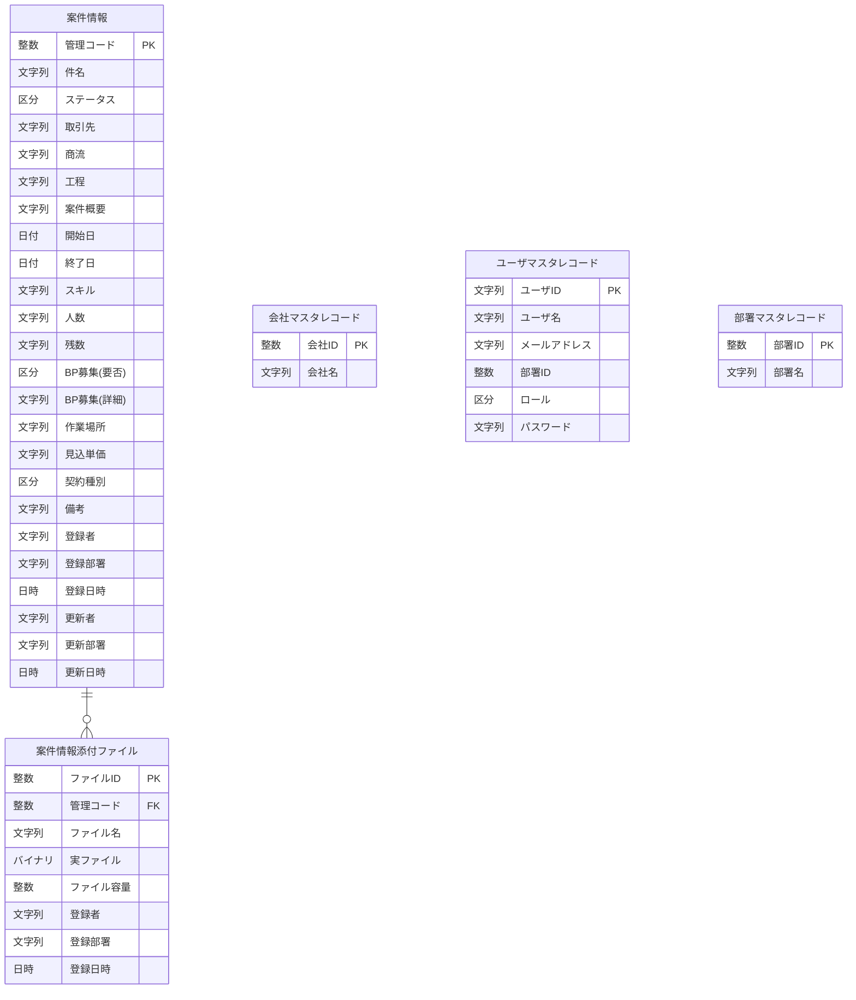

# 営業情報管理システム ER図

## ヘッダー

| 項目 | 内容 | 
| :--- | :--- | 
| ドキュメント名 | 一覧・図表 |
| システム名 | 営業情報管理システム | 
| 機能グループ | ー | 
| 機能 | ER図 |
| 作成年月日 | 2026/06/12 | 
| 作成者 | SSV/社員A |
| 変更年月日 | |
| 変更者 | |

## エンティティ一覧

| No | エンティティ名 | 機能グループ |
| :------------ | :------------ | :---------- |
| 1 | 案件情報 | 案件情報管理 |
| 2 | 案件情報添付ファイル | 案件情報管理 | 
| 3 | 会社マスタレコード| マスタ管理 |
| 4 | ユーザマスタレコード | マスタ管理 | 
| 5 | 部署マスタレコード | マスタ管理 |

## ER図
