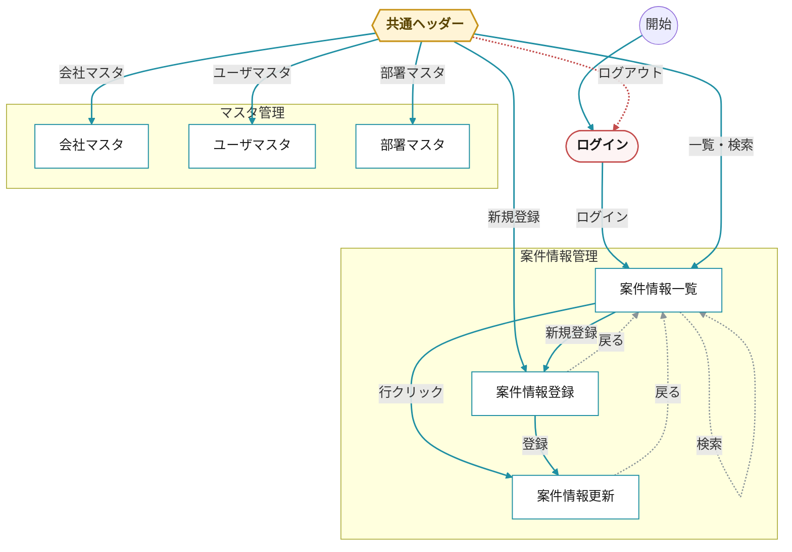

# 営業情報管理システム ／ 画面遷移図

## ヘッダー

| 画面 | 項目 | 
| :--- | :--- | 
| ドキュメント名 | 一覧・図表 |
| システム名 | 営業情報管理システム | 
| 機能グループ | ー | 
| 機能 | 画面遷移図 |
| 作成年月日 | 2026/06/12 | 
| 作成者 | SSV/社員A |
| 変更年月日 | |
| 変更者 | |

---

## 凡例

| 表現 | 意味 |
|:----|:----|
| 円形 `○` (黒) | 開始地点 | 
| 矩形 `□`（白） | メインビューポートで表示される画面 | 
| 矩形 `□`（水色） | ある画面の一部である画面 |
| 六角形 `⬡`（黄） | 画面間で共通するレイアウト |
| スタジアム `( )`（赤） | 共通レイアウトがない画面 |
| `──▶` 実線（青緑） | 画面遷移（前進） |
| `┄┄▶` 破線（グレー） | キャンセル／完了で戻る |
| `┄┄▶` 破線（赤） | ログアウト |

---

## 画面遷移図

