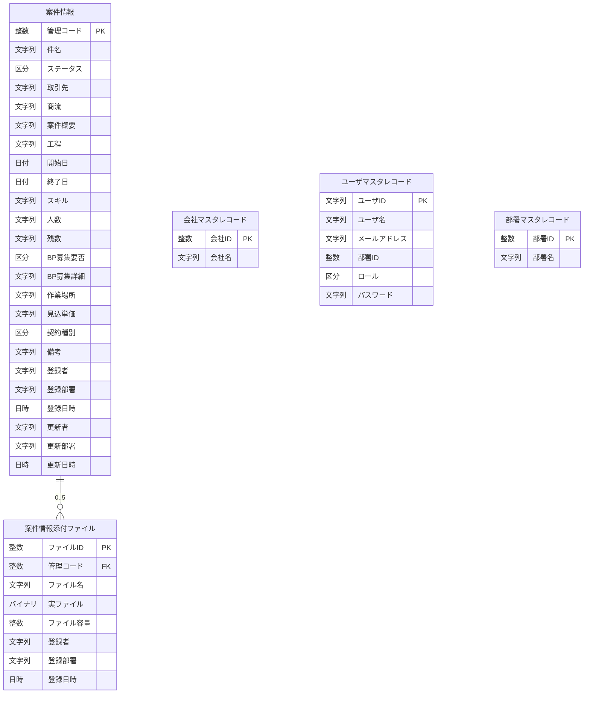

# ER図

基本設計（`docs/specs/基本設計/エンティティ/ER図.md`）を流用・更新。論理名で表記し、物理テーブル名・列・型はテーブル定義書で確定する。

- 案件情報 (E01) 1 ─ 0..5 案件情報添付ファイル (E02)（添付は1案件に0〜5件）
- 会社マスタ・ユーザマスタ・部署マスタは独立マスタ。ユーザの部署ID・案件の取引先・登録者/登録部署は**論理参照（DB外部キーではない）**。

> 注: 取引先（案件情報）は会社マスタ外の名称も許容。ユーザの部署ID は登録時点で部署マスタに存在するが DB 外部キーではない（部署削除による不整合は参照側機能で処理）。登録者/登録部署/更新者/更新部署はユーザ・部署マスタの変更・削除の影響を受けない記録値。
