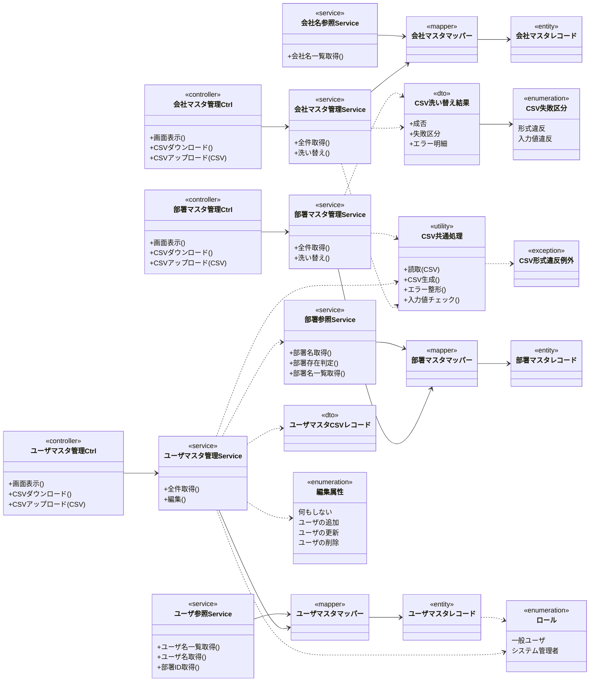

# クラス図 ― マスタ管理（会社／ユーザ／部署）＋ 横断参照リソース

論理名で表記（物理名は各定義書で確定）。各マスタは管理画面（CSV）と、リソース指向の**横断参照サービス**（他機能が名称取得・存在チェックに利用）を 1:1 で持つ。マスタ管理画面はシステム管理者のみアクセス可。

> 補足: 横断参照サービス（会社名/ユーザ/部署）は基本設計に提供側の明示定義がない（利用要求のみ）ため、リソース指向でマスタ管理側に定義した（サービス一覧表・各サービス定義書で確定済み）。部署マスタの削除・部署ID変更時の整合チェックは部署側では行わず、参照側（共通レイアウト初期表示・案件登録等）で処理する。また、CSV 洗い替えは各マスタ共通の CSV 基盤（CSV共通処理・CSV洗い替え結果・CSV失敗区分・CSV形式違反例外）で実現し、会社・部署は専用の CSV データ構造を持たない（ユーザのみ ユーザマスタCSVレコード を持つ）。CSV共通処理の読取・CSV生成が従う様式（囲み文字・エスケープ）と読み取り方式の正本は CSV共通仕様 システム共通仕様書。
