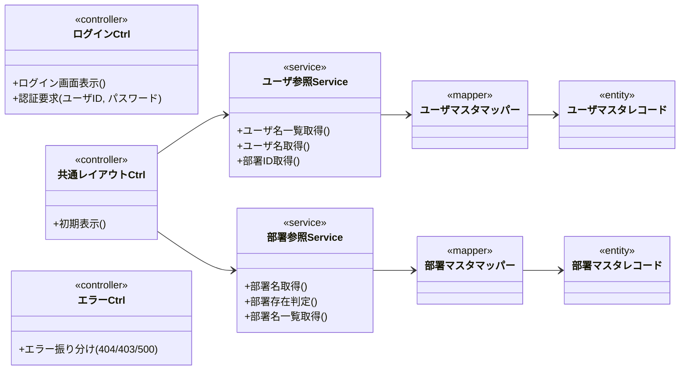

# クラス図 ― 共通基盤（認証・認可／共通レイアウト／エラー／ログイン）

論理名で表記（物理名は各定義書で確定）。レイヤ: コントローラー → サービス → Mapper(1表専用) → エンティティ。
認証・認可はフレームワーク（フォームログイン／URLベースのアクセス制御）が担うため、本図には業務クラスとして示さない（許可表・アクセス制御の遷移は画面遷移図を参照）。共通レイアウトの初期表示はユーザ参照・部署参照（マスタ管理所属の横断参照）を利用する。

> 補足: 認証・認可はフレームワークのフォームログイン・URLベースのアクセス制御が担い、許可表・アクセス制御の遷移は画面遷移図を参照する（本図では業務クラスのみを示す）。ユーザ参照・部署参照は機能グループ＝マスタ管理に所属する横断参照リソースだが、テーブル/DBIF のみに依存するため共通基盤からも利用される。
