# クラス図 ― 案件情報管理（一覧／登録／更新）

論理名で表記（物理名は各定義書で確定）。レイヤ: 画面/APIコントローラー → サービス → Mapper(1表専用) → エンティティ。
取引先/登録者/登録部署のオートコンプリート・ユーザ情報取得は、マスタ管理所属の横断参照（会社名参照・ユーザ参照・部署参照）を利用。営業情報メール送信は共通サービスで、登録・更新が契機を所有。

```mermaid
classDiagram
    direction LR

    class 案件情報一覧Ctrl {
        <<controller>>
        +案件情報一覧表示()
    }
    class 案件情報登録Ctrl {
        <<controller>>
        +登録画面表示()
        +案件登録(案件登録Form)
    }
    class 案件情報更新Ctrl {
        <<controller>>
        +更新画面表示(管理コード)
        +案件更新(案件更新Form)
    }
    class 案件検索API {
        <<controller>>
        +案件検索(案件検索条件)
    }
    class 添付ファイルAPI {
        <<controller>>
        +添付一覧取得(管理コード)
        +添付ダウンロード(ファイルID)
        +添付削除(ファイルID)
    }

    class 案件検索Service {
        <<service>>
        +案件検索()
    }
    class 案件登録Service {
        <<service>>
        +案件登録()
    }
    class 案件更新Service {
        <<service>>
        +案件取得()
        +添付一覧取得()
        +案件更新()
        +添付ダウンロード()
        +添付削除()
    }
    class 営業情報メール送信Service {
        <<service>>
        +メール送信(案件情報, メール本文)
    }

    class 案件情報マッパー {
        <<mapper>>
    }
    class 案件情報添付ファイルマッパー {
        <<mapper>>
    }
    class 案件情報 {
        <<entity>>
    }
    class 案件情報添付ファイル {
        <<entity>>
    }

    class 案件検索条件 {
        <<form>>
    }
    class 案件登録Form {
        <<form>>
    }
    class 案件更新Form {
        <<form>>
    }
    class ステータス {
        <<enumeration>>
        オープン
        交渉中
        クローズ
    }
    class 契約種別 {
        <<enumeration>>
        請負
        準委任
        派遣
    }
    class BP募集要否 {
        <<enumeration>>
        必要
        不要
    }

    class 会社名参照Service {
        <<service>>
    }
    class ユーザ参照Service {
        <<service>>
    }
    class 部署参照Service {
        <<service>>
    }

    案件情報一覧Ctrl --> 会社名参照Service
    案件情報一覧Ctrl --> ユーザ参照Service
    案件情報一覧Ctrl --> 部署参照Service
    案件検索API --> 案件検索Service
    添付ファイルAPI --> 案件更新Service
    案件情報登録Ctrl --> 案件登録Service
    案件情報更新Ctrl --> 案件更新Service

    案件検索Service --> 案件情報マッパー

    案件登録Service --> 案件情報マッパー
    案件登録Service --> 案件情報添付ファイルマッパー
    案件登録Service --> 営業情報メール送信Service
    案件登録Service ..> ユーザ参照Service
    案件登録Service ..> 部署参照Service
    案件登録Service ..> 会社名参照Service

    案件更新Service --> 案件情報マッパー
    案件更新Service --> 案件情報添付ファイルマッパー
    案件更新Service --> 営業情報メール送信Service
    案件更新Service ..> ユーザ参照Service
    案件更新Service ..> 部署参照Service

    案件情報マッパー --> 案件情報
    案件情報添付ファイルマッパー --> 案件情報添付ファイル

    案件検索Service ..> 案件検索条件
    案件登録Service ..> 案件登録Form
    案件更新Service ..> 案件更新Form
    案件情報 ..> ステータス
    案件情報 ..> 契約種別
    案件情報 ..> BP募集要否
```

> 補足: API パスは各 API 定義書で、モデル型・列挙型の物理名は型情報定義書で確定済み。排他制御の方式は基本設計に未記載のため詳細設計で確定した（案件情報の更新日時を読込時の値と照合する楽観排他。専用のバージョン列は設けない）。案件情報一覧のCSVダウンロードはクライアント完結（クリック時点で取得済みの全ページを対象とし、サーバへの再取得は行わない）で確定。
