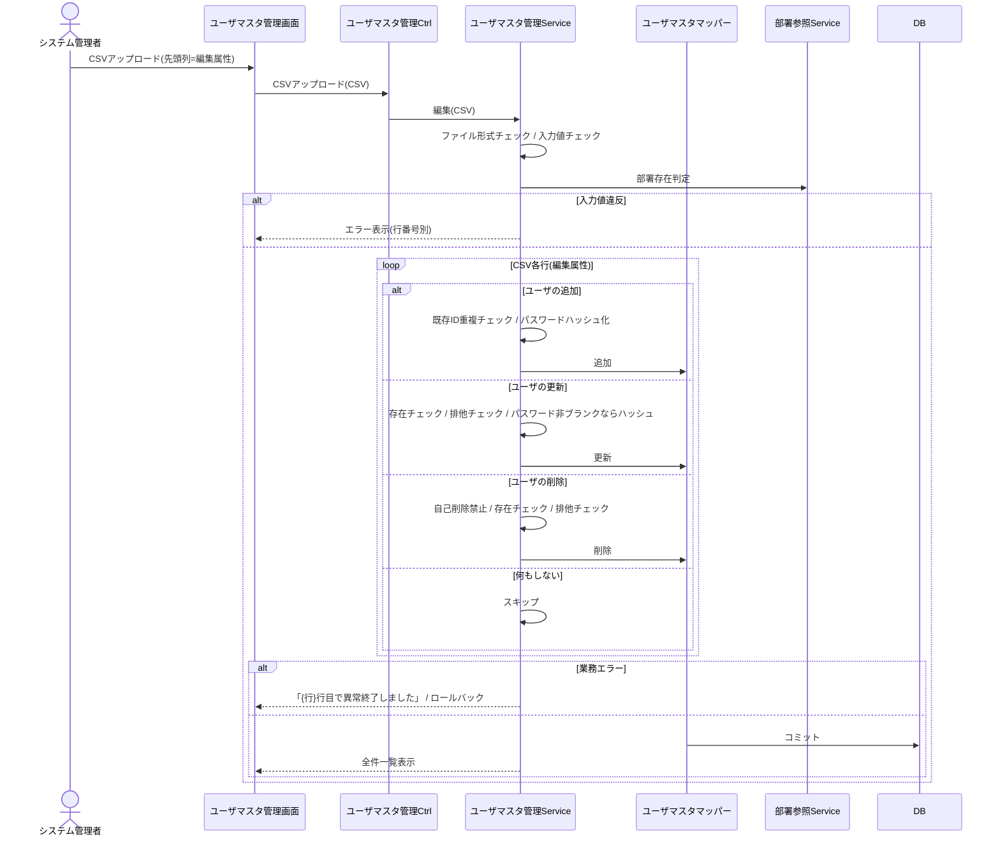

# シーケンス図 ― ユーザマスタ管理（CSV編集）

CSVの行ごとの編集属性（追加/更新/削除）に従い処理。パスワードのハッシュ化はユーザ認証認可 システム共通仕様書に従う。部署IDは部署マスタ存在チェック。

> 横断参照「ユーザ参照」（ユーザ名取得）は本グループに定義。排他「他のユーザが更新中」は、存在確認の後に実行した更新・削除の件数が0件であること（確認から実行までの間に他の処理が当該レコードを変更・削除した競合）で判定する（案件更新の更新日時照合とは異なる方式）。
