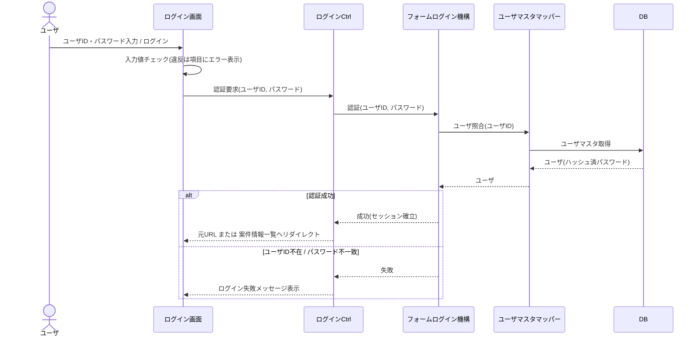

# シーケンス図 ― ログイン（認証）

ログイン画面で入力値チェック後、認証はフレームワークのフォームログイン機構へ委譲する（ユーザマスタとの照合・パスワードはハッシュ照合）。成功時は元URL（なければ案件情報一覧）へ遷移。

> ログイン維持の失効条件はユーザ認証認可 システム共通仕様書「ログインの維持と失効」に従う。認証はフレームワークの標準フォームログイン機構が実施し、パスワードはハッシュ照合による（同仕様書「認証方式」「パスワードのハッシュ化」参照）。
