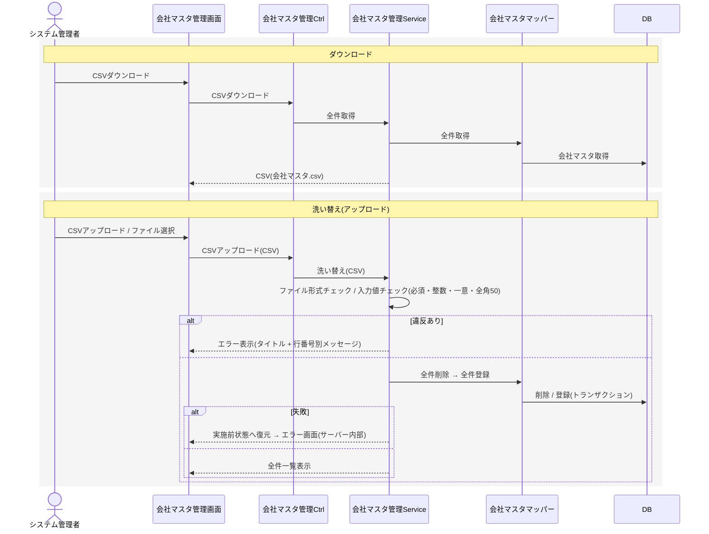

# シーケンス図 ― 会社マスタ管理（CSV洗い替え）

全件ダウンロードと、CSVアップロードによる洗い替え（全件削除→登録）。システム管理者のみ。

```mermaid
sequenceDiagram
    actor A as システム管理者
    participant V as 会社マスタ管理画面
    participant C as 会社マスタ管理Ctrl
    participant S as 会社マスタ管理Service
    participant CM as 会社マスタマッパー
    participant DB as DB

    rect rgb(245,245,245)
    Note over A,DB: ダウンロード
    A->>V: CSVダウンロード
    V->>C: CSVダウンロード
    C->>S: 全件取得
    S->>CM: 全件取得
    CM->>DB: 会社マスタ取得
    S-->>V: CSV(会社マスタ.csv)
    end

    rect rgb(245,245,245)
    Note over A,DB: 洗い替え(アップロード)
    A->>V: CSVアップロード / ファイル選択
    V->>C: CSVアップロード(CSV)
    C->>S: 洗い替え(CSV)
    S->>S: ファイル形式チェック / 入力値チェック(必須・整数・一意・全角50)
    alt 違反あり
        S-->>V: エラー表示(タイトル + 行番号別メッセージ)
    else
        S->>CM: 全件削除 → 全件登録
        CM->>DB: 削除 / 登録(トランザクション)
        alt 失敗
            S-->>V: 実施前状態へ復元 → エラー画面(サーバー内部)
        else
            S-->>V: 全件一覧表示
        end
    end
    end
```

> 横断参照「会社名参照」（取引先オートコンプリート用）は本グループに別途定義（リソース指向 1:1）。基本設計に提供側の明示定義はないが、詳細設計で【会社名参照サービス】として確定済み。
