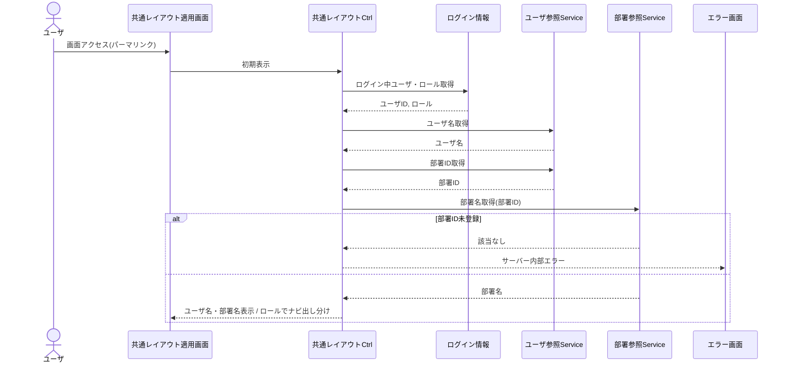

# シーケンス図 ― 共通レイアウト 初期表示

共通レイアウトを持つ各画面の初期表示。ログイン中ユーザのユーザ名・部署名・ロールを取得し、ロールでナビ（マスタ管理系）を出し分ける。部署ID未登録時はサーバー内部エラー。

> 一般ユーザには会社/ユーザ/部署マスタのナビを非表示。ユーザ名・部署名取得は横断参照リソース（マスタ管理所属）を利用する。ログイン情報（ログイン中ユーザ・ロール）はフレームワーク側で管理される。
