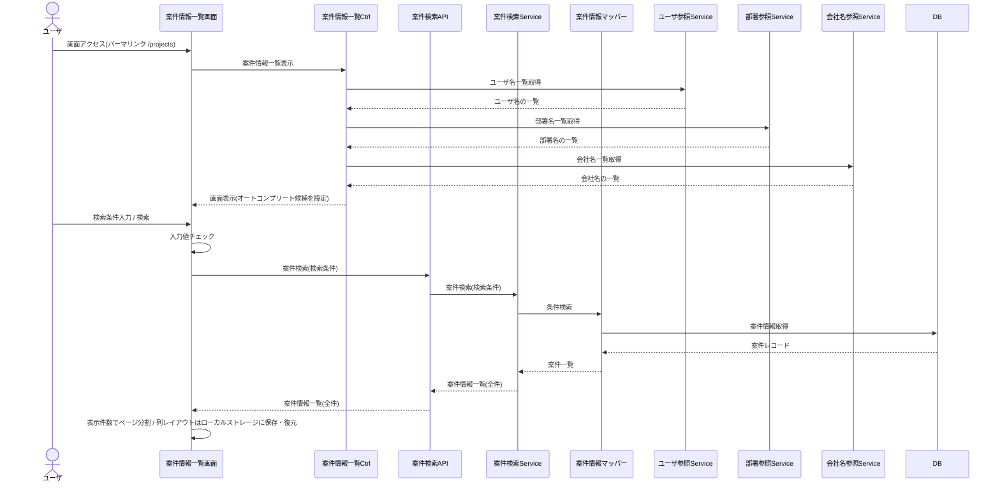

# シーケンス図 ― 案件情報一覧（検索）

検索条件で案件情報を全件取得し、表示件数でのページ分割・列レイアウトはクライアント側で扱う。状態保持用のサーバAPIは設けない。

```mermaid
sequenceDiagram
    actor U as ユーザ
    participant V as 案件情報一覧画面
    participant C as 案件情報一覧Ctrl
    participant A as 案件検索API
    participant S as 案件検索Service
    participant PM as 案件情報マッパー
    participant UR as ユーザ参照Service
    participant DR as 部署参照Service
    participant CR as 会社名参照Service
    participant DB as DB

    U->>V: 画面アクセス(パーマリンク /projects)
    V->>C: 案件情報一覧表示
    C->>UR: ユーザ名一覧取得
    UR-->>C: ユーザ名の一覧
    C->>DR: 部署名一覧取得
    DR-->>C: 部署名の一覧
    C->>CR: 会社名一覧取得
    CR-->>C: 会社名の一覧
    C-->>V: 画面表示(オートコンプリート候補を設定)
    U->>V: 検索条件入力 / 検索
    V->>V: 入力値チェック
    V->>A: 案件検索(検索条件)
    A->>S: 案件検索(検索条件)
    S->>PM: 条件検索
    PM->>DB: 案件情報取得
    DB-->>PM: 案件レコード
    PM-->>S: 案件一覧
    S-->>A: 案件情報一覧(全件)
    A-->>V: 案件情報一覧(全件)
    V->>V: 表示件数でページ分割 / 列レイアウトはローカルストレージに保存・復元
```

> 検索条件はログイン状態が続く限り保存（ログアウトで破棄）。CSVダウンロードはクリック時点で取得済みの全ページが対象で、クライアント完結（サーバへの再取得は行わない）。
