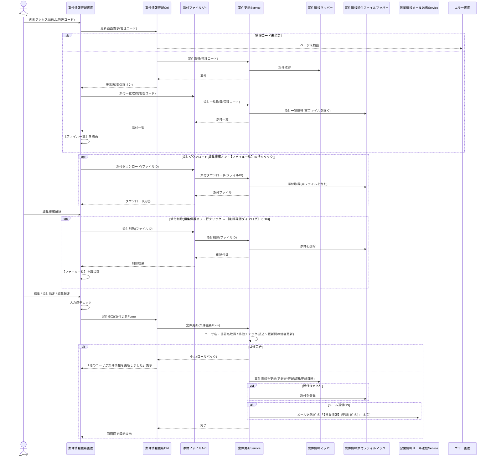

# シーケンス図 ― 案件情報更新

URLの管理コードで表示し、編集確定で更新。読込〜更新間に他ユーザが更新した場合は排他制御で中止。添付の追加/DL/削除、メール送信を含む。

> 添付ファイルの一覧取得・ダウンロード・削除は【添付ファイルAPI】で確定済み。排他制御の方式は基本設計に未記載のため詳細設計で確定した（案件情報の更新日時を読込時の値と照合する楽観排他。専用のバージョン列は設けない）。登録者・登録日時は更新対象に含めない。
