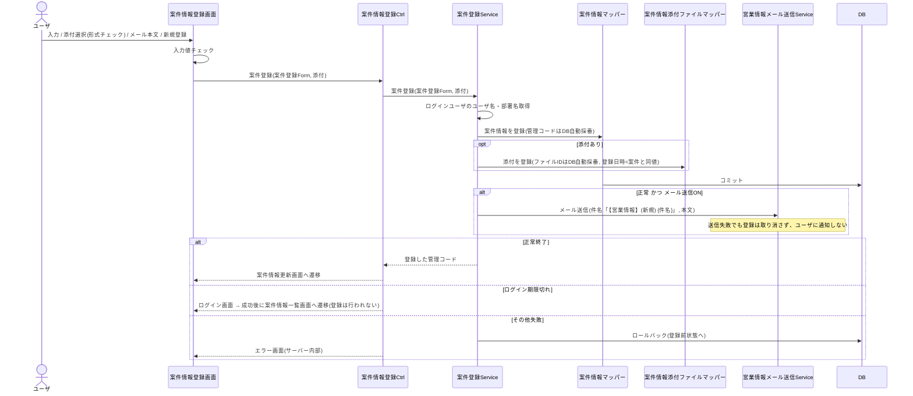

# シーケンス図 ― 案件情報登録

管理コードのDB自動採番、ログインユーザのユーザ名・部署名記録、添付登録、メール送信を一連で処理。失敗時はロールバック。

```mermaid
sequenceDiagram
    actor U as ユーザ
    participant V as 案件情報登録画面
    participant C as 案件情報登録Ctrl
    participant S as 案件登録Service
    participant PM as 案件情報マッパー
    participant FM as 案件情報添付ファイルマッパー
    participant M as 営業情報メール送信Service
    participant DB as DB

    U->>V: 入力 / 添付選択(形式チェック) / メール本文 / 新規登録
    V->>V: 入力値チェック
    V->>C: 案件登録(案件登録Form, 添付)
    C->>S: 案件登録(案件登録Form, 添付)
    S->>S: ログインユーザのユーザ名・部署名取得
    S->>PM: 案件情報を登録(管理コードはDB自動採番)
    opt 添付あり
        S->>FM: 添付を登録(ファイルIDはDB自動採番, 登録日時=案件と同値)
    end
    PM->>DB: コミット
    alt 正常 かつ メール送信ON
        S->>M: メール送信(件名「【営業情報】(新規) {件名}」, 本文)
        Note over M: 送信失敗でも登録は取り消さず、ユーザに通知しない
    end
    alt 正常終了
        S-->>C: 登録した管理コード
        C-->>V: 案件情報更新画面へ遷移
    else ログイン期限切れ
        C-->>V: ログイン画面 → 成功後に案件情報一覧画面へ遷移(登録は行われない)
    else その他失敗
        S->>DB: ロールバック(登録前状態へ)
        C-->>V: エラー画面(サーバー内部)
    end
```

> 添付ファイルは1回の登録につき1件。1つの案件情報あたりの累計上限は5件だが、新規登録は既存0件のため上限判定は行わない（累計の判定は案件情報更新が担う）。
