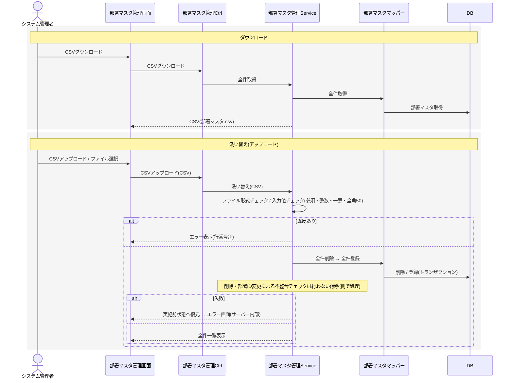

# シーケンス図 ― 部署マスタ管理（CSV洗い替え）

全件ダウンロードと、CSVアップロードによる洗い替え（全件削除→登録）。削除・部署ID変更による不整合は本機能では検査せず、参照側機能で処理する。システム管理者のみ。

```mermaid
sequenceDiagram
    actor A as システム管理者
    participant V as 部署マスタ管理画面
    participant C as 部署マスタ管理Ctrl
    participant S as 部署マスタ管理Service
    participant DM as 部署マスタマッパー
    participant DB as DB

    rect rgb(245,245,245)
    Note over A,DB: ダウンロード
    A->>V: CSVダウンロード
    V->>C: CSVダウンロード
    C->>S: 全件取得
    S->>DM: 全件取得
    DM->>DB: 部署マスタ取得
    S-->>V: CSV(部署マスタ.csv)
    end

    rect rgb(245,245,245)
    Note over A,DB: 洗い替え(アップロード)
    A->>V: CSVアップロード / ファイル選択
    V->>C: CSVアップロード(CSV)
    C->>S: 洗い替え(CSV)
    S->>S: ファイル形式チェック / 入力値チェック(必須・整数・一意・全角50)
    alt 違反あり
        S-->>V: エラー表示(行番号別)
    else
        S->>DM: 全件削除 → 全件登録
        DM->>DB: 削除 / 登録(トランザクション)
        Note over S: 削除・部署ID変更による不整合チェックは行わない(参照側で処理)
        alt 失敗
            S-->>V: 実施前状態へ復元 → エラー画面(サーバー内部)
        else
            S-->>V: 全件一覧表示
        end
    end
    end
```

> 横断参照「部署参照」（部署名取得・部署存在判定）は本グループに定義（共通レイアウト初期表示・ユーザマスタ編集等が利用）。
