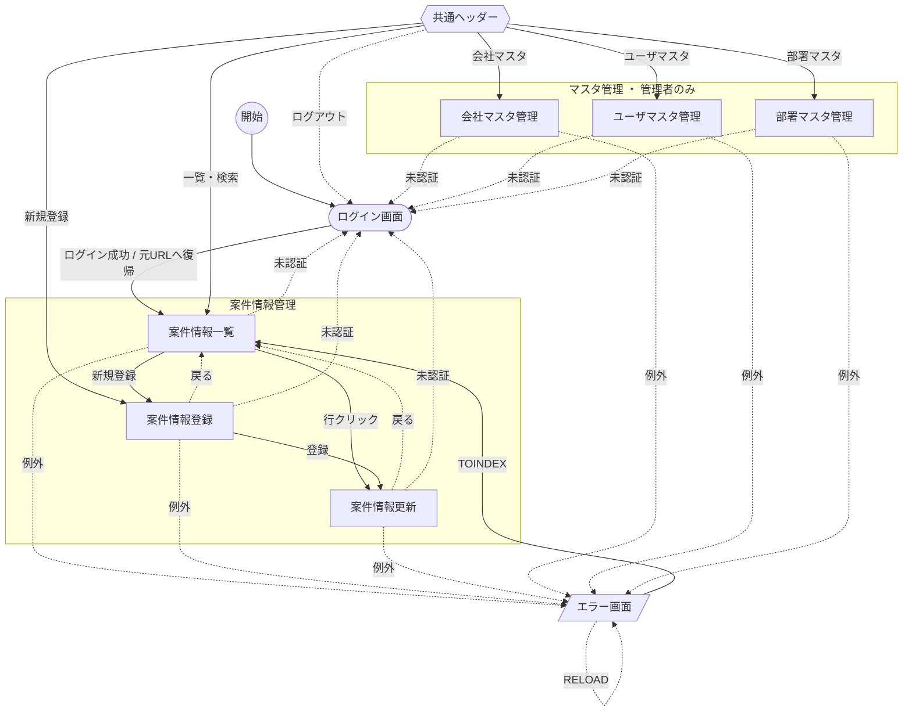

# 画面遷移図

基本設計（`docs/specs/基本設計/画面レイアウト・機能仕様書/画面遷移図_一覧・図表.md`）を流用し、認証リダイレクト・エラー画面遷移を加筆した詳細設計向けの俯瞰図。

- 共通ヘッダーのマスタ管理ナビ（会社/ユーザ/部署）は**システム管理者のみ表示・遷移可**（一般ユーザは非表示）。
- 未認証で各画面（パーマリンク）へアクセスした場合はログイン画面へリダイレクトし、成功後に元URLへ復帰。
- 存在しないURLへのアクセスは、未認証であってもログイン画面へ誘導せず404エラー画面へ遷移する（ログイン後の復帰先にも保存しない）。
- 例外発生時はエラー画面（404/403/サーバー内部）へ遷移。

> 凡例: 実線=前進遷移、破線=戻る/ログアウト/例外。ログイン画面・エラー画面は共通レイアウト（共通ヘッダー）を持たない。ドメインURL（/）は未ログイン時=ログイン画面、ログイン済み時=案件情報一覧画面。
